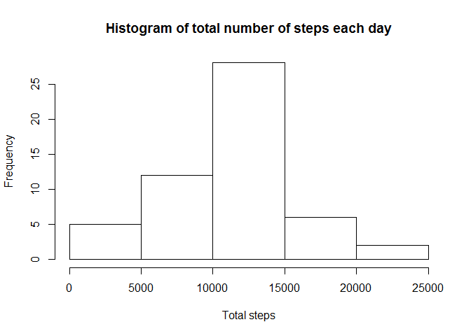
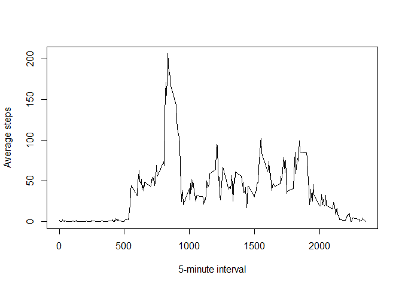
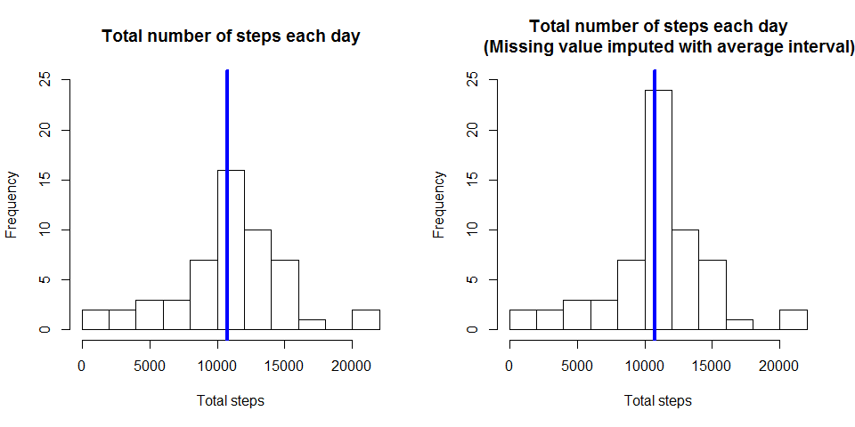

# Reproducible Research: Peer Assessment 1


## Loading and preprocessing the data
Load the data from source and store to dataset in R.  

```r
activityData <- read.csv("./data/activity.csv")
head(activityData)
```

```
##   steps       date interval
## 1    NA 2012-10-01        0
## 2    NA 2012-10-01        5
## 3    NA 2012-10-01       10
## 4    NA 2012-10-01       15
## 5    NA 2012-10-01       20
## 6    NA 2012-10-01       25
```
We see that the data type for column date is not properly set.  

```r
str(activityData)
```

```
## 'data.frame':	17568 obs. of  3 variables:
##  $ steps   : int  NA NA NA NA NA NA NA NA NA NA ...
##  $ date    : Factor w/ 61 levels "2012-10-01","2012-10-02",..: 1 1 1 1 1 1 1 1 1 1 ...
##  $ interval: int  0 5 10 15 20 25 30 35 40 45 ...
```

So, change data type to date.

```r
activityData$date <- as.Date(activityData$date)
str(activityData)
```

```
## 'data.frame':	17568 obs. of  3 variables:
##  $ steps   : int  NA NA NA NA NA NA NA NA NA NA ...
##  $ date    : Date, format: "2012-10-01" "2012-10-01" ...
##  $ interval: int  0 5 10 15 20 25 30 35 40 45 ...
```

We also noted, there are **2304** missing value in the dataset.


```r
sum(is.na(activityData))
```

```
## [1] 2304
```

## What is mean total number of steps taken per day?
Lets explore the dataset by plotting a histogram to visualize the frequency distribution of total steps per day. In this stage, we will first exclude missing value (NA) data. As missing value will introduced bias in the analysis, on later part of the report, we will conduct an imputation process and compare the results between dataset with missing value and imputed value.

To find out the mean of total number of steps per day, we aggregate the data by date (excluding the 2304 missing value) then sum the total number of steps for each day using *dplyr* package.  We asign the result to dataset *sumSteps*. 


```r
library(dplyr)
```

```
## 
## Attaching package: 'dplyr'
```

```
## The following objects are masked from 'package:stats':
## 
##     filter, lag
```

```
## The following objects are masked from 'package:base':
## 
##     intersect, setdiff, setequal, union
```

```r
#Calculate the total number of steps taken per day
sumSteps <- activityData[!is.na(activityData$steps),] %>% group_by(date) %>% summarise(total = sum(steps))
```

For now, the histogram of total steps per day is as follows:

```r
hist(sumSteps$total, axes = TRUE, xlab = "Total steps", main = "Histogram of total number of steps each day")
```

\

To understand the dataset more, we find the mean and median steps per day.

```r
meanSteps <- mean(sumSteps$total)
meanSteps
```

```
## [1] 10766.19
```

```r
medSteps <- median(sumSteps$total)
medSteps
```

```
## [1] 10765
```

The mean and median steps per day are **10766.19** and **10765** respectively.

## What is the average daily activity pattern?
Let's explore more on the dataset.  Now we want to find the average daily steps by 5-minute interval.  TO do so, we group the data by *interval* and find the average steps.  Then plot a chart to visualize the dataset.

```r
#Make a time series plot of the 5-minute interval (x-axis) and the average number of steps taken, 
#averaged across all days (y-axis)
avgSteps <- activityData[!is.na(activityData$steps),] %>% group_by(interval) %>% summarise(average = mean(steps))
plot(avgSteps$interval, avgSteps$average, type="l", xlab="5-minute interval", ylab="Average steps")
```

\

From the daily average steps, we want to find the interval when maximum average daily steps happened.

```r
maxInterval<- avgSteps[avgSteps$average==max(avgSteps$average),]
maxInterval
```

```
## Source: local data frame [1 x 2]
## 
##   interval  average
##      (int)    (dbl)
## 1      835 206.1698
```
**Maximum** average daily steps is at **835** of the 5-minute interval.

## Imputing missing values

We already know there are **2304** missing value in the dataset.Before imputation process, we need to confirm which fields have the missing value. First, check for missing value in *steps* field.  

```r
#Calculate the total number of missing values in the dataset (i.e. the total number of rows with NAs)
nrow(activityData[is.na(activityData$steps),])
```

```
## [1] 2304
```
From the result above, we prove all 2304 of missing value are in the *steps* field.  So, we could confirm only field *steps* has missing value, not in other fields i.e. *date* and *interval*.  The data imputation later will pertaining to field *steps* only.

For the imputation, we take average daily steps by intervals as impute value. The average calculation are excluding the missing value rows. 

The imputation process are as follows:

1. Duplicate the original dataset into new dataset *activityImpute*.

```r
activityImpute <- activityData
```

2.  Calculate the average *steps* for each unique *interval* for all *dates* where *steps* are not NA.  The calculated average stored in *average* field.  For this step, we just make use *avgSteps* dataset from previous calculation in *What is the average daily activity pattern* section.

```r
head(avgSteps)
```

```
## Source: local data frame [6 x 2]
## 
##   interval   average
##      (int)     (dbl)
## 1        0 1.7169811
## 2        5 0.3396226
## 3       10 0.1320755
## 4       15 0.1509434
## 5       20 0.0754717
## 6       25 2.0943396
```

3.  Find the index of missing value in original dataset; *activityData*. Two indices created:
    + *na.interval* is index for field *interval* with missing value *steps*; and
    + *na.indices* is the row index with missing value in field *steps*.

```r
na.steps <- which(is.na(activityImpute$steps))
na.interval <- activityImpute$interval[na.steps]
na.indices <- is.na(activityImpute$steps)
```

4.  Match the *interval* between missing value row and *average* value row then impute the *average* value to missing field in *activityImpute* dataset.

```r
activityImpute$steps[na.indices] <- avgSteps$average[match(na.interval, avgSteps$interval)]
```

5. After imputation process, we confirmed there is no remaining missing data in the *activityImpute* dataset.

```r
nrow(activityImpute[is.na(activityImpute$steps),])
```

```
## [1] 0
```

We plot two histograms for both dataset which are before and after imputation dataset, to see is there any effect of the imputation.   

```r
sumStepsImpute <- activityImpute[!is.na(activityImpute$steps),] %>% group_by(date) %>% summarise(total = sum(steps))
```


```r
par(mfrow=c(1,2))
hist(sumSteps$total, 10, xlab = "Total steps", ylim=c(0,25), 
     main = "Total number of steps each day")
abline(v = median(sumSteps$total), col = 4, lwd = 4)

hist(sumStepsImpute$total, 10, xlab = "Total steps", ylim = c(0,25),
     main = "Total number of steps each day
     (Missing value imputed with average interval)")
abline(v = median(sumStepsImpute$total), col = 4, lwd = 4)
```

\

The blue vertical lines indicate median of the dataset.  From histogram above, we could see there is changes in maximum frequency.  To further confirm the difference between both dataset, we compute the mean and median value. 

**Mean**

```r
meanStepsImpute <- mean(sumStepsImpute$total)
meanStepsImpute
```

```
## [1] 10766.19
```

**Median**

```r
medStepsImpute <- median(sumStepsImpute$total)
medStepsImpute
```

```
## [1] 10766.19
```

Table below indicates the comparison between before and after data imputation for mean and median.

Data    | Mean                                             | Median
--------|--------------------------------------------------|-----------
Missing |10766.19       |10765
Impute  |10766.19 |10766.19

From the table we could see, the mean remains the same for both dataset.  This could be because we are using mean step's value to impute missing data.  However, there is a difference in median of imputed dataset where it moved higher by 1.19 or 0.01% to 10766.19 steps.

## Are there differences in activity patterns between weekdays and weekends?
We want to explore whether there are differences in activity pattern during weekdays and weekend.  We will compare the average steps across all days in weekdays (monday to friday) with average steps on weekend (Saturday and Sunday) for each 5-minute interval.  

To do so, first convert *date* given to day name *i.e.* Monday, ..., Sunday by applying *weekday()* function and stored in *wkDay* field.  

```r
activityImpute$day <- weekdays(activityImpute$date)
```

Then, create a new factor variable *day.f* in the dataset with two levels - "weekday" and "weekend".

```r
activityImpute$day.f <- as.factor(c("weekday", "weekend"))
```

Run through a process to indicate whether a given date is a weekday or weekend where
weekday= c("Monday", "Tuesday", "Wednesday", "Thursday", "Friday") and weekend = c("Saturday", "Sunday").

```r
activityImpute$day.f[!(activityImpute$day=="Saturday" | activityImpute$day=="Sunday")] <- factor("weekday")
activityImpute$day.f[activityImpute$day=="Saturday" | activityImpute$day=="Sunday"] <- factor("weekend")
```

Create new dataset *avgImpute* with the average steps by factor field *day.f* and *interval*   

```r
avgImpute <- activityImpute %>% group_by(day.f, interval) %>% summarise(average = mean(steps))
```

Finally, make a panel plot containing a time series plot of the 5-minute interval (x-axis) and the average number of steps taken, averaged across all weekday days or weekend days (y-axis).  We use *ggplot2* package to perform this task.


```r
library(ggplot2)
p <- ggplot(avgImpute, aes(x=interval, y=average)) + geom_line() + xlab("Interval") + ylab("Number of steps")
#p <- p + scale_color_manual(values="#CC6666") #c("#CC6666", "#9999CC"))
p + facet_wrap(~day.f, nrow = 2)
```

\

From the chart above, we could see there are difference in activity between weekend and weekday.  In the weekday there is a jump in activity on 750 to 1000 interval, while the rest remain lower throughout the day. For the weekend the range of high activity is longer which is between interval 750 to 2000.  

From the observation we could conclude that in weekday people are more active in the earlier day, while in the weekend people stay active through out the day.
